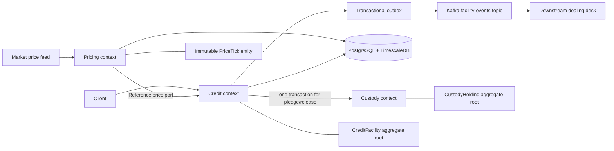

# Context And Aggregate View

Project dependency direction: Domain has no infrastructure dependency; Application depends on Domain; Persistence implements application ports; Infrastructure composes adapters and background jobs; Presentation is the single web composition root.